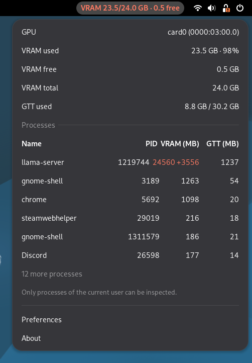

# VRAM Monitor

GNOME Shell extension that shows GPU video memory (VRAM) usage in the top bar,
with a per-process breakdown.



## Features

- Top bar label, e.g. `VRAM 21.1/24.0 GB · 2.9 free`, in three formats: full,
  compact (`VRAM 21.1/24.0 GB`) or percentage (`VRAM 88%`).
- The label is highlighted above a configurable usage threshold (90% by default).
- Menu with:
  - used / free / total VRAM, GTT usage and the monitored card (`card0 (0000:03:00.0)`);
  - the processes using the GPU, sorted by VRAM: name, PID, VRAM (MB), GTT (MB),
    limited to N rows and refreshed while the menu is open;
  - Preferences and About entries.
- Preferences: refresh interval, alert threshold, maximum number of processes,
  GPU (automatic = the card with the most VRAM, or a specific card), label format.
- Translations: English, French.

## Requirements

- GNOME Shell 48.
- An AMD GPU driven by `amdgpu`. Other drivers (NVIDIA, Intel…) do not expose
  the sysfs counters used here; the label then shows `VRAM n/a`.

## Installation

### From extensions.gnome.org

Search for “VRAM Monitor” in the Extension Manager application, or install it
from its page on extensions.gnome.org.

### From source

```bash
git clone https://github.com/laurentL/vram-monitor.git
cd vram-monitor
make install
```

On Wayland, log out and back in, then enable it:

```bash
gnome-extensions enable vram-monitor@laurentl.github.io
```

## How it works

- Totals come from `/sys/class/drm/cardN/device/mem_info_vram_{used,total}` and
  `mem_info_gtt_{used,total}`. The card's PCI address is the target of the
  `device` symlink.
- Per-process usage comes from `/proc/<pid>/fdinfo/<fd>` for the file
  descriptors that point to `/dev/dri/*` (keys `drm-client-id`, `drm-pdev`,
  `drm-total-vram`, `drm-total-gtt`). Clients are de-duplicated by
  (`drm-pdev`, `drm-client-id`), then aggregated per PID.
- All reads are asynchronous (Gio) and cancelled when the extension is disabled.
  `/proc` is only scanned while the menu is open; the totals are read every
  refresh interval. No external program is spawned.

## Limitations

- Only the processes of the current user can be inspected: `/proc/<pid>/fdinfo`
  of other users' processes is not readable without root.
- `drm-total-vram` counts every buffer a client has a handle to, including
  buffers shared with other processes, so the per-process values can add up to
  more than the used VRAM.
- On some amdgpu kernels `drm-memory-vram` / `drm-resident-vram` report values
  larger than the card itself; they are only used when `drm-total-vram` is
  missing (older kernels).
- Sizes are binary units (1 GB = 1024³ bytes), as reported by the kernel.

## Development

```bash
npm install          # ESLint, for `make lint` only
make lint            # ESLint with the configuration recommended by gjs.guide
make pack            # dist/vram-monitor@laurentl.github.io.shell-extension.zip
make install         # install the zip for the current user
make nested          # nested GNOME Shell session to test the installed extension
make pot update-po   # refresh po/vram-monitor.pot and merge it into po/*.po
```

The zip is built with `gnome-extensions pack --extra-source=gpu.js --podir=po`;
translations are compiled into it, `.po` files and build files are not shipped.

To add a translation, copy `po/vram-monitor.pot` to `po/<lang>.po`, translate it
and run `make pack`.

### Screenshot to take

`docs/screenshot.png` is referenced above and is not in the repository yet:
take it with the menu open (`make nested`, or your own session), preferably on
a session without personal process names.

## License

GPL-2.0-or-later, see [LICENSE](LICENSE).
